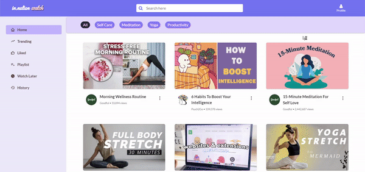

  
  <h1><a href="https://innotion-watch.netlify.app/">inNotion - Watch</a> - Self Care Video Library</h1>
    
A Video library which helps you begin your self-care journey with meditation, productivity, mindfullness, etc videos!

 

  <h2>Preview☀️</h2>
  
 

## Available Screens
- Landing Page/Video Listing Page
- Single Video Page
- Trending Video Page
- Playlist Management Page
- Single playlist Page
- Watch Later Page
- History Page
- Liked Videos Page
- Authentication (Login, Signup and Logout) Pages
- Page not found(404 page)

## Features:
Responsive screens with:
- **Landing Page** with all videos listed. Multiple categories available for user to filter selected category.
- Feature in Landing page: options of Watch Later, create new Playlist, add or remove the video from Playlist, filter by categories.
- **Single Video Page** - User can like video, add/remove video from watch Later, Add/Remove from Playlist.
- **Playlist Management Page**, consists of all custom Playlists, user can browse in playlist, delete video from playlist and delete playlist.
- **Watch Later Page** - List of watch later videos. User can remove the video from Watch Later.
- **History Page** - List of videos in history. User can remove the video from History.
- **Liked Videos Page** - List of all liked videos. User can remove the video from Liked Videos.

## Technologies & Concepts used

- React JS with useReducer + useContext
- React-router-dom
- -React-toastify
- JSX
- HTML/CSS
- inNotion UI library for styled components.
To know about the styled components, their variations, read the [inNotion UI Documentation](https://innotion-ui.netlify.app/).
- Git For Version Control
- Netlify for Deployment
- Cloudinary for Image Hosting of Video Thumbnails

